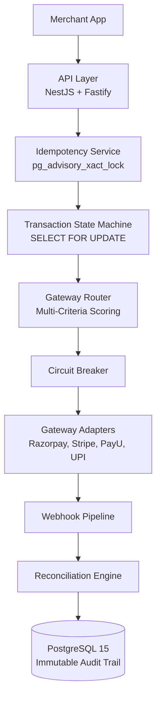

# PayFlow Orchestration Layer

Production-grade payment orchestration backend routing transactions across Razorpay, Stripe, PayU, and UPI with intelligent multi-criteria routing, sub-2-second gateway failover, absolute idempotency, and immutable audit trails.

---

## Quick Start

```bash
git clone <repository-url>
cd payflow-orchestration-layer

cp .env.example .env.local

docker-compose up -d
```

Health check:

```bash
curl -H "X-API-Key: dev-api-key-001" \
http://localhost:3000/api/v1/health
```

Expected response:

```json
{
  "status": "ok"
}
```

---

## Architecture

```text
Merchant App
    ↓
API Layer (NestJS + Fastify)
    ↓
Idempotency Service (pg_advisory_xact_lock)
    ↓
Transaction State Machine (SELECT FOR UPDATE)
    ↓
Gateway Router (Multi-Criteria Scoring)
    ↓
Circuit Breaker → Gateway Adapters
(Razorpay, Stripe, PayU, UPI)
    ↓
Webhook Pipeline → Reconciliation Engine
    ↓
PostgreSQL 15
(11 Tables + Immutable Audit Trail)
```

Or rendered with Mermaid:



---

## Technology Stack

| Component | Choice                   | Reason                                                  |
| --------- | ------------------------ | ------------------------------------------------------- |
| Framework | NestJS 10 + Fastify      | Dependency injection, high throughput, raw body support |
| Database  | PostgreSQL 15            | Advisory locks, JSONB, row-level locking                |
| ORM       | TypeORM                  | Migration tooling, QueryBuilder locking support         |
| Language  | TypeScript (Strict Mode) | Compile-time safety for financial operations            |

---

## Key Design Decisions

- **BIGINT paise storage**  
  All monetary values are stored as integer paise. Never FLOAT.

- **Pessimistic locking**  
  `SELECT FOR UPDATE` protects state transitions. Locks are released before external gateway calls.

- **Advisory locks**  
  `pg_advisory_xact_lock` guarantees microsecond-level idempotency.

- **Immutable audit trail**  
  `transaction_state_log` is append-only with database-level enforcement.

- **Raw body webhook verification**  
  Signatures are validated against the raw request buffer, not re-serialized JSON.

---

## API Reference

Base URL:

```text
http://localhost:3000/api/v1
```

Authentication:

```text
X-API-Key header required on all endpoints except webhooks
```

| Method | Endpoint                         | Description                 |
| ------ | -------------------------------- | --------------------------- |
| POST   | `/payments`                      | Initiate payment            |
| GET    | `/payments/:id`                  | Get payment by ID           |
| GET    | `/payments?merchant_order_id=`   | Get payment by order ID     |
| POST   | `/payments/:id/capture`          | Capture authorized payment  |
| POST   | `/payments/:id/void`             | Void authorized payment     |
| POST   | `/payments/:id/refund`           | Initiate refund             |
| GET    | `/payments/:id/refunds`          | List refunds                |
| GET    | `/payments/:id/timeline`         | State transition history    |
| POST   | `/webhooks/razorpay`             | Razorpay webhook receiver   |
| POST   | `/webhooks/stripe`               | Stripe webhook receiver     |
| POST   | `/webhooks/payu`                 | PayU webhook receiver       |
| POST   | `/webhooks/upi`                  | UPI callback receiver       |
| GET    | `/gateways`                      | List gateways with health   |
| GET    | `/gateways/:name/health`         | Circuit breaker state       |
| GET    | `/gateways/:name/metrics`        | Gateway performance metrics |
| PUT    | `/gateways/:name/config`         | Update gateway config       |
| GET    | `/routing/config`                | Current routing weights     |
| PUT    | `/routing/config`                | Update routing weights      |
| POST   | `/reconciliation/trigger`        | Trigger reconciliation run  |
| GET    | `/reconciliation/reports/:runId` | Reconciliation report       |
| GET    | `/reconciliation/anomalies`      | Unresolved anomalies        |
| GET    | `/analytics/success-rate`        | Success rate by gateway     |
| GET    | `/analytics/volume`              | Transaction volume by day   |
| GET    | `/health`                        | System health check         |

---

## Failure Scenario Coverage

| Scenario                         | Mechanism                                     |
| -------------------------------- | --------------------------------------------- |
| FS-01 Gateway timeout            | Circuit breaker + failover under 2 seconds    |
| FS-02 Duplicate webhook          | `processed_webhook_events` deduplication      |
| FS-03 Double submit              | Advisory lock + idempotency key               |
| FS-04 5xx on capture             | Exponential backoff + `CAPTURE_FAILED` state  |
| FS-05 Partial capture            | `PARTIALLY_CAPTURED` state tracking           |
| FS-06 Webhook before response    | State machine duplicate transition rejection  |
| FS-07 Cascade failure            | OPEN gateways excluded from router scoring    |
| FS-08 Refund settled transaction | Valid `SETTLED → REFUND_INITIATED` transition |
| FS-09 Concurrent race            | Transaction-level advisory locking            |
| FS-10 Replay attack              | HMAC verification + event deduplication       |
| FS-11 Missing settlement         | Reconciliation anomaly detection              |
| FS-12 UPI timeout                | `AUTH_EXPIRED` terminal state                 |
| FS-13 Key collision              | Composite `(merchant_id, key)` scoping        |
| FS-14 Connection exhaustion      | Short-lived locks + connection pooling        |
| FS-15 State corruption           | Invalid transition exception before DB write  |

---

## Running Tests

```bash
# Unit tests
npm run test:unit

# Failure scenario tests
npm run test:scenarios

# Full test suite with coverage
npm run test:all
```

---

## Deliberate Errors Found

See:

```text
docs/errors-found.md
```

The document contains the 5 technical specification errors identified during implementation.

---

## Project Structure

```text
src/
├── common/
│   ├── enums
│   ├── exceptions
│   ├── guards
│   └── interceptors
│
├── database/
│   └── migrations
│
└── modules/
    ├── transactions/
    │   ├── state-machine
    │   ├── services
    │   └── repositories
    │
    ├── gateways/
    │   ├── adapters
    │   ├── router
    │   ├── circuit-breaker
    │   └── health
    │
    ├── idempotency/
    │   └── advisory-locks
    │
    ├── webhooks/
    │   ├── signature
    │   ├── queue
    │   └── processor
    │
    └── reconciliation/
        ├── batch-engine
        └── scheduler
```
