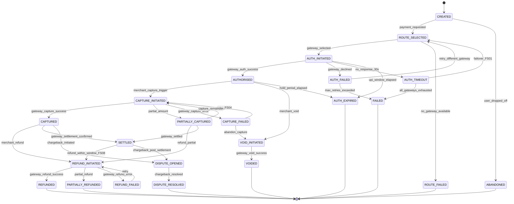

## Mermaid Diagram for `docs/state-machine.md`

```mermaid
stateDiagram-v2
    [*] --> CREATED

    CREATED --> ROUTE_SELECTED : payment_requested
    CREATED --> ABANDONED : user_dropped_off

    ROUTE_SELECTED --> AUTH_INITIATED : gateway_selected
    ROUTE_SELECTED --> ROUTE_FAILED : no_gateway_available

    AUTH_INITIATED --> AUTHORISED : gateway_auth_success
    AUTH_INITIATED --> AUTH_FAILED : gateway_declined
    AUTH_INITIATED --> AUTH_TIMEOUT : no_response_30s
    AUTH_INITIATED --> AUTH_EXPIRED : upi_window_elapsed

    AUTH_FAILED --> ROUTE_SELECTED : retry_different_gateway
    AUTH_FAILED --> FAILED : max_retries_exceeded
    AUTH_TIMEOUT --> ROUTE_SELECTED : failover_FS01
    AUTH_TIMEOUT --> FAILED : all_gateways_exhausted

    AUTHORISED --> CAPTURE_INITIATED : merchant_capture_trigger
    AUTHORISED --> VOID_INITIATED : merchant_void
    AUTHORISED --> AUTH_EXPIRED : hold_period_elapsed

    CAPTURE_INITIATED --> CAPTURED : gateway_capture_success
    CAPTURE_INITIATED --> PARTIALLY_CAPTURED : partial_amount
    CAPTURE_INITIATED --> CAPTURE_FAILED : gateway_capture_error

    CAPTURE_FAILED --> CAPTURE_INITIATED : retry_FS04
    CAPTURE_FAILED --> VOID_INITIATED : abandon_capture

    PARTIALLY_CAPTURED --> CAPTURE_INITIATED : capture_remainder
    PARTIALLY_CAPTURED --> REFUND_INITIATED : refund_partial
    PARTIALLY_CAPTURED --> SETTLED : gateway_settled

    VOID_INITIATED --> VOIDED : gateway_void_success

    CAPTURED --> REFUND_INITIATED : merchant_refund
    CAPTURED --> SETTLED : gateway_settlement_confirmed
    CAPTURED --> DISPUTE_OPENED : chargeback_initiated

    SETTLED --> REFUND_INITIATED : refund_within_window_FS08
    SETTLED --> DISPUTE_OPENED : chargeback_post_settlement

    REFUND_INITIATED --> REFUNDED : gateway_refund_success
    REFUND_INITIATED --> PARTIALLY_REFUNDED : partial_refund
    REFUND_INITIATED --> REFUND_FAILED : gateway_refund_error

    REFUND_FAILED --> REFUND_INITIATED : retry

    DISPUTE_OPENED --> DISPUTE_RESOLVED : chargeback_resolved

    REFUNDED --> [*]
    PARTIALLY_REFUNDED --> [*]
    VOIDED --> [*]
    FAILED --> [*]
    ABANDONED --> [*]
    ROUTE_FAILED --> [*]
    AUTH_EXPIRED --> [*]
    DISPUTE_RESOLVED --> [*]
```
